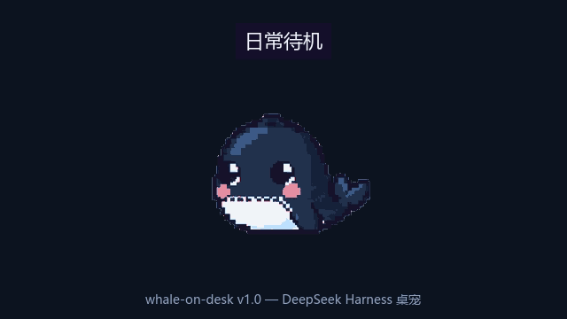

# whale-on-desk 🐳

English | [中文](docs/README.zh.md) | [🏠 Landing site](https://cookiesheep.github.io/whale-on-desk/)

**A pixel-art whale companion for [DeepSeek Harness](https://github.com/deepseek-ai/deepseek-harness) — one that actually knows what your agents are doing.**

Start a long task, walk away, and come back when the whale tells you it's done. It reports finished turns with real numbers, taps the glass (and flashes your tab title) when an approval is waiting, and counts your tool calls as a school of fish.

   



## Why it's not just a sticker

| Agent activity | Whale reaction |
|---|---|
| Turn starts | waves hello, then gets to work 👋 |
| Model streaming | thinks along / swims laps 💭 |
| Tool call | blows a labeled bubble (敲命令 / 读文件 / …) |
| **Turn finishes** | **speaks up: "搞定! 3 分 12 秒,跑了 8 个工具,改了 5 个文件"** |
| **Approval waiting** | **taps the glass; the browser tab title flashes 🔔** |
| Context filling | eats at 62%/82%, sinks past 84% 📉 |
| Compaction | curls into a ball to digest |
| Idle 5 min | asks for work ("我闲着呢,有活吗?") |
| 10 min idle / late night | sleeps, or wears a nightcap 🌙 |
| You click / pet / poke it | quips, purrs, startled flail (synth sounds, zero assets) |

Every sprite ships only after a frame-by-frame pixel audit — exact 8-color palette, zero debris, seamless loops.

## Install (30 seconds)

```sh
dsh plugin --profile web add whale-on-desk
```

Open (or restart) the DSH web UI — that's it, no API key, no config. Works in the [community DSH Desktop app](https://github.com/anywhere-labs/deepseek-harness-desktop) too: tray → **Open DSH Terminal** → `dsh plugin add whale-on-desk` → restart the app.

## Two more tricks

- **⌘ Command palette** (right-click the whale): DSH ships a full command registry but the web UI never got a launcher — the whale brought one. Filter, run, no model turn spent.
- **🐠 Aquarium mode** (right-click): a painted water skin over your working UI — keep coding inside the tank while the whale mirrors your agent, token fish count tool calls, a coral grows with your progress, and a depth gauge reads the context window.

## Uninstall / configure

```sh
dsh plugin --profile web remove whale-on-desk
```

Sleep timeout is configurable in `cordis.patch.yml` (`sleepAfterMinutes`, default 10). Right-click the whale for a small menu (mute sounds / reset position / switch pet / hide — double-click the corner 🐳 to restore). Setting `allowPreview: true` additionally exposes `POST /whale/preview {"state":"glass-tap"}` (clear with `{"state":null}`) — handy for demos and screenshots; off by default.

## Managing the plugin (GUI)

`dsh plugin add whale-on-desk` is the official install path, and the ecosystem provides GUI managers on top of it:

- **[dsh-plugin-toggle](https://github.com/DamonKoy/dsh-web-ui)** adds a Settings → Plugins switchboard: every loaded plugin (including this whale) gets a card with a start/stop toggle — no config rewrites.
- **dsh-market** adds an in-harness plugin market: browse and one-click install community plugins from the curated lists.

Install either once (`dsh plugin --profile web add dsh-plugin-toggle`), and day-to-day management stays in the UI. The whale's own right-click menu also has hide/show, and `enabled: false` in its config unmounts it entirely.

## Aquarium mode


Right-click the whale → **🐠 水族馆** for a fullscreen tank: painted water plates (auto light/dark), seaweed, a progress coral that grows with your tool calls, token fish counting the turn's tools — and the whale itself mirrors the agent state, tapping the glass (buoy blinking) when an approval waits. The water layer stays translucent and click-through: you keep coding inside it. Esc (or the ✕ button) brings back the companion.

## Pet forge (AI-crafted pets)

The plugin registers a **pet-forge** skill in your harness: ask your agent *"给我做一只粉色章鱼桌宠"* and it will design the sprite sheet, run it through the same pixel audit the bundled whale passes, cut the GIF, install it as a pet pack, and switch to it live — no restart. (Requires ffmpeg on PATH.)

## Custom pets

Drop a sprite pack into `~/.dsh/whale-on-desk/pets/<name>/` — a `manifest.json` mapping states to GIF files, plus the GIFs:

```json
{ "idle": "idle.gif", "glass-tap": "tap.gif" }
```

States you don't provide fall back to your `idle` sprite, and any file you don't ship falls back to the bundled whale. Right-click the whale to switch pets; the change applies instantly (no reload). Related config: `pet` (pet name to activate at boot), `petsDir`, and `enabled: false` to unmount the overlay entirely.

## How it works

- **Host half** (`lib/index.js`): a Cordis plugin listening to `session/event` (turns, chunks, tool calls, approvals — all durable session events) and folding them into a small state machine (`lib/pet-machine.mjs`). Exposes `/whale/state`, `/whale/poke`, `/whale/assets/*` on the DSH web server. Read-only: it never touches your sessions or files.
- **Browser half** (`lib/client.js`): registers via the DSH shell module loader, mounts into the `shell.overlay` slot, renders the current state's sprite (500 ms poll), plays synthesized sounds, and persists its position.
- **Art pipeline** (`tools/process-sprites.mjs`): AI-generated sprite sheets in, clean looping GIFs out — slicing, exact 8-color palette snapping (pure nearest-color math), magenta chroma-key, decoration removal.

## Making your own states

See [`docs/GPT_PROMPT_PLAYBOOK.md`](docs/GPT_PROMPT_PLAYBOOK.md) — the full workflow for generating new whale animations with an AI image tool, and the one-line pipeline command that turns a sheet into a live state.

## Project layout

```
art/     source sprite sheets from the AI workflow (repo only)
assets/  shipped runtime: state GIFs + manifest.json
docs/    art spec, prompt playbook, canonical character reference
lib/     plugin host half + browser half + state machine
test/    state machine unit tests
tools/   sprite processing pipeline + test grid generator
```

## Credits & disclaimer

Animation grammar and pixel discipline inspired by [clawd-on-desk](https://github.com/rullerzhou-afk/clawd-on-desk) (style reference only — no assets or code shared; clawd art is Anthropic's). Whale art generated with AI assistance. Not affiliated with DeepSeek. MIT licensed.
